# Korean Search Tuner — 전체 아키텍처 & 기능 플로우

## 목차
1. [프로젝트 개요](#1-프로젝트-개요)
2. [헥사고날 아키텍처](#2-헥사고날-아키텍처)
3. [멀티모듈 구조](#3-멀티모듈-구조)
4. [도메인 모델](#4-도메인-모델)
5. [기능 플로우 — 상품 색인](#5-기능-플로우--상품-색인)
6. [기능 플로우 — 검색](#6-기능-플로우--검색)
7. [기능 플로우 — 동의어 생성 & 적용](#7-기능-플로우--동의어-생성--적용)
8. [기능 플로우 — 분석기 추천](#8-기능-플로우--분석기-추천)
9. [기능 플로우 — 검색 품질 평가](#9-기능-플로우--검색-품질-평가)
10. [기능 플로우 — A/B 비교 & 통계 검증](#10-기능-플로우--ab-비교--통계-검증)
11. [기능 플로우 — Blue-Green 마이그레이션](#11-기능-플로우--blue-green-마이그레이션)
12. [IR 메트릭 수학적 원리](#12-ir-메트릭-수학적-원리)
13. [Elasticsearch 인덱스 설계](#13-elasticsearch-인덱스-설계)
14. [전체 API 목록](#14-전체-api-목록)
15. [인프라 & 실행 방법](#15-인프라--실행-방법)
16. [기술 결정 이유 (ADR 요약)](#16-기술-결정-이유-adr-요약)

---

## 1. 프로젝트 개요

### 무엇을 해결하는가

한국 이커머스 검색의 두 가지 핵심 문제를 해결한다.

**문제 1 — 측정 가능성 부재**

"AI 동의어 사전을 도입했더니 검색이 좋아졌습니다"는 측정 불가능한 주장이다.
이 프로젝트는 **정량적이고 재현 가능한 검색 품질 측정 파이프라인**을 제공한다.

```
nDCG@10: 0.72 → 0.85 (+17.7%)
P@5:     0.68 → 0.81 (+19.1%)
MRR:     0.74 → 0.88 (+18.3%)
p-value: 0.003 (통계적으로 유의)
```

**문제 2 — 다운타임 없는 동의어 적용**

일반적인 ES 동의어 변경은 인덱스를 close → 설정 변경 → open 해야 한다.
이 프로젝트는 **두 가지 무중단 전략**을 제공한다.

| 전략 | 방식 | 적합한 경우 |
|---|---|---|
| Reload | `updateable: true` + `_reload_search_analyzers` | 동의어 사전만 변경 |
| Blue-Green | 신규 인덱스 빌드 → Alias 원자적 전환 | 분석기/매핑 변경 |

---

## 2. 헥사고날 아키텍처

### 개념

헥사고날 아키텍처(Ports & Adapters)의 핵심 규칙은 **"의존성은 항상 바깥 → 안쪽으로만"** 이다.
비즈니스 로직이 담긴 Core는 Spring, MySQL, Elasticsearch를 전혀 모른다.

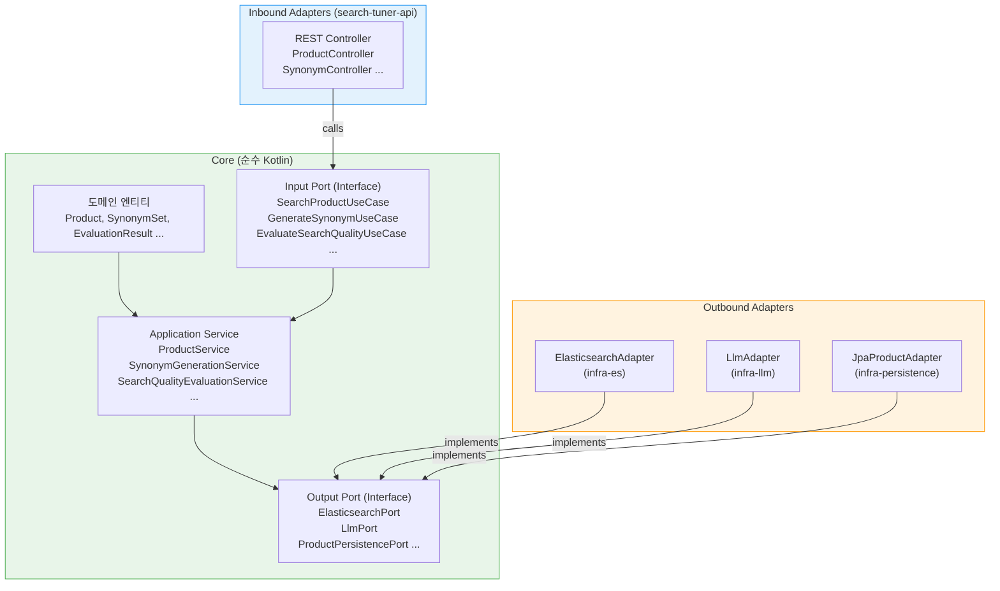

### 의존성 방향

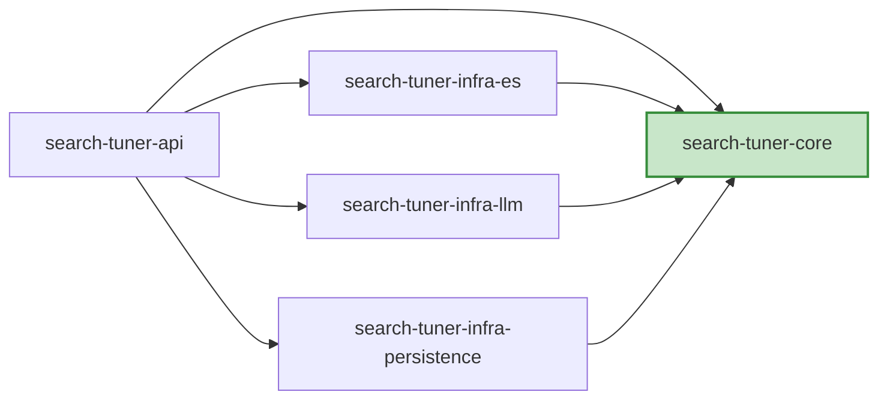

**Core는 아무것도 의존하지 않는다.** Spring 어노테이션조차 없다.
따라서 Core의 단위 테스트는 Spring Context 없이 순수 JVM으로 실행된다.

---

## 3. 멀티모듈 구조

```
search-tuner/
├── build.gradle.kts                    # 루트: 공통 플러그인 버전, 서브프로젝트 공통 설정
├── settings.gradle.kts                 # 5개 모듈 include
├── gradle/libs.versions.toml           # Version Catalog (단일 버전 관리)
├── docker-compose.yml                  # MySQL 8 + ES 8.17 (Nori)
├── docker/
│   ├── elasticsearch/Dockerfile        # elasticsearch:8.17.0 + analysis-nori plugin
│   ├── elasticsearch/config/synonyms/  # 동의어 파일 (volume mount)
│   └── mysql/init.sql                  # 스키마 DDL
│
├── search-tuner-core/                  # 순수 Kotlin, Spring 무의존
│   └── src/main/kotlin/.../core/
│       ├── domain/                     # 도메인 엔티티 (data class)
│       │   ├── product/Product.kt
│       │   ├── shop/Shop.kt
│       │   ├── synonym/SynonymSet.kt, SynonymGroup.kt, SynonymType.kt
│       │   ├── analyzer/AnalyzerConfig.kt
│       │   ├── evaluation/EvaluationResult.kt, QueryEntry.kt, RelevanceScore.kt
│       │   └── index/IndexJob.kt, MigrationJob.kt
│       └── application/
│           ├── port/in/                # Input Port (UseCase Interface)
│           ├── port/out/               # Output Port (Repository/External Interface)
│           └── service/                # UseCase 구현체
│               └── metric/IrMetricCalculator.kt  # nDCG, P@K, MRR, t-test
│
├── search-tuner-infra-es/              # ES Java Client 8.x
│   └── src/main/kotlin/.../infra/es/
│       ├── config/ElasticsearchConfig.kt
│       ├── adapter/ElasticsearchAdapter.kt  # ElasticsearchPort 구현
│       ├── index/ProductIndexer.kt          # IndexProductUseCase 구현
│       ├── index/IndexJobRegistry.kt        # ConcurrentHashMap 기반 Job 추적
│       ├── index/MigrationJobRegistry.kt
│       └── dto/ProductDocument.kt
│
├── search-tuner-infra-llm/             # Spring AI — 공통 (인터페이스 + 어댑터 + 프롬프트)
│   └── src/main/kotlin/.../infra/llm/
│       ├── config/LlmConfig.kt         # 전략 선택 + ChatClient Bean 등록
│       ├── provider/LlmProviderStrategy.kt  # 전략 인터페이스 (buildChatClient)
│       ├── LlmAdapter.kt               # LlmPort 구현
│       ├── LlmResponseParser.kt        # markdown 코드블록 strip + JSON parse
│       └── prompt/                     # 동의어/분석기/Relevance 프롬프트 템플릿
│
├── search-tuner-infra-llm-gemini/      # Gemini 전략 (priority=2, GEMINI_API_KEY/MODEL)
├── search-tuner-infra-llm-openai/      # OpenAI 전략 (priority=1, OPENAI_API_KEY/MODEL)
├── search-tuner-infra-llm-claude/      # Claude 전략 (priority=3, ANTHROPIC_API_KEY/MODEL)
│
├── search-tuner-infra-persistence/     # Spring Data JPA + MySQL
│   └── src/main/kotlin/.../infra/persistence/
│       ├── entity/                     # JPA @Entity
│       ├── repository/                 # JpaRepository interface
│       └── adapter/                    # XxxPersistencePort 구현
│
└── search-tuner-api/                   # Spring Boot 진입점
    └── src/main/kotlin/.../api/
        ├── SearchTunerApplication.kt
        ├── config/                     # Swagger, Jackson, Service Bean 등록
        ├── controller/                 # REST Controllers (5개)
        ├── dto/request/, dto/response/ # API DTO
        └── init/
            ├── DataInitializer.kt      # 앱 시작 시 샘플 데이터 생성
            └── GoldenQuerySetLoader.kt # golden_query_set.yaml 로드
```

### 기술 스택 버전

| 컴포넌트 | 버전 | 비고 |
|---|---|---|
| Spring Boot | 3.4.3 | Spring AI 호환성 확보 |
| Kotlin | 2.1.20 | Spring Boot 3.4 BOM 기준 |
| Spring AI | 1.0.0 GA | `spring-ai-starter-model-openai` / `spring-ai-starter-model-anthropic` |
| ES Java Client | 8.17.0 | |
| SpringDoc OpenAPI | 2.8.5 | |
| MySQL | 8.0 | Docker |
| Elasticsearch | 8.17.0 | Docker + Nori plugin |
| Java toolchain | 21 | |

---

## 4. 도메인 모델

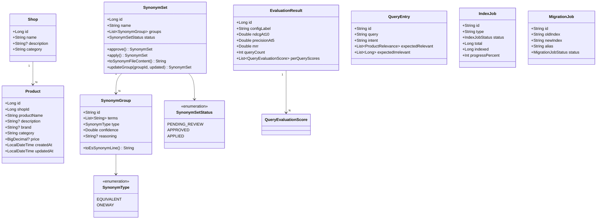

### 도메인 불변식

**SynonymGroup.toEsSynonymLine()** — ES 동의어 파일 포맷으로 직렬화

```kotlin
// EQUIVALENT: 나이키, Nike, NIKE, 나이크
"나이키, Nike, NIKE, 나이크"

// ONEWAY: 캐구 => 캐나다구스 (캐구 검색 시 캐나다구스도 매칭, 반대는 아님)
"캐구 => 캐나다구스"
```

**SynonymSet** — 상태 전이

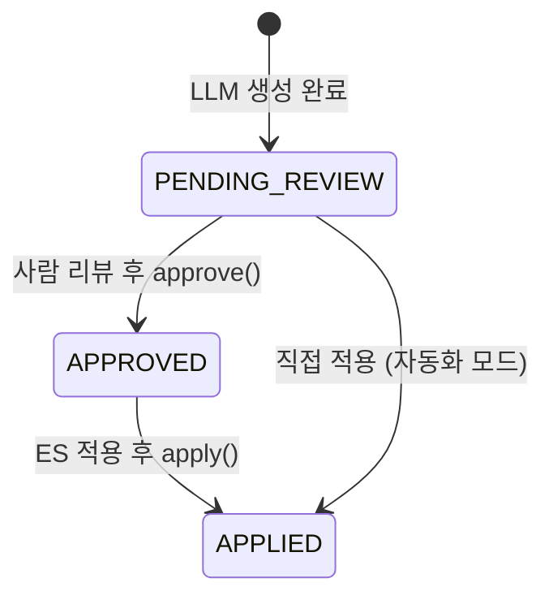

---

## 5. 기능 플로우 — 상품 색인

### 5.1 전체 색인 (Full Index)

MySQL에 저장된 모든 상품을 ES로 색인한다. 1,000건씩 청크로 나눠 Bulk API로 전송한다.

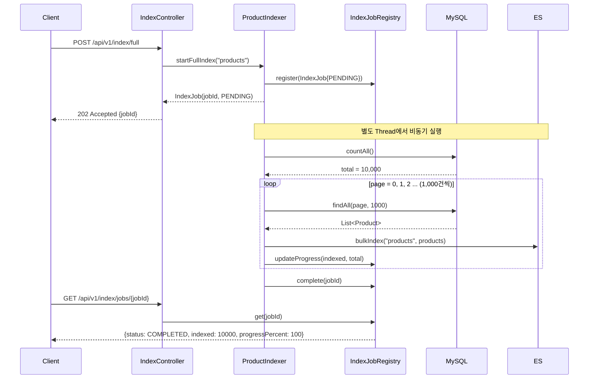

**핵심 설계 포인트:**
- `@Async` 대신 `Thread { }.start()` — Spring AOP는 동일 클래스 내부 호출 시 프록시를 거치지 않아 `@Async`가 무효화되기 때문
- `IndexJobRegistry` = `ConcurrentHashMap<String, IndexJob>` — 인메모리 Job 상태 추적
- Chunk size 1,000 — Spring Batch의 청크 지향 처리와 동일한 패턴을 단순화 구현

### 5.2 증분 색인 (Incremental Sync)

마지막 동기화 이후 변경된 상품만 색인한다.

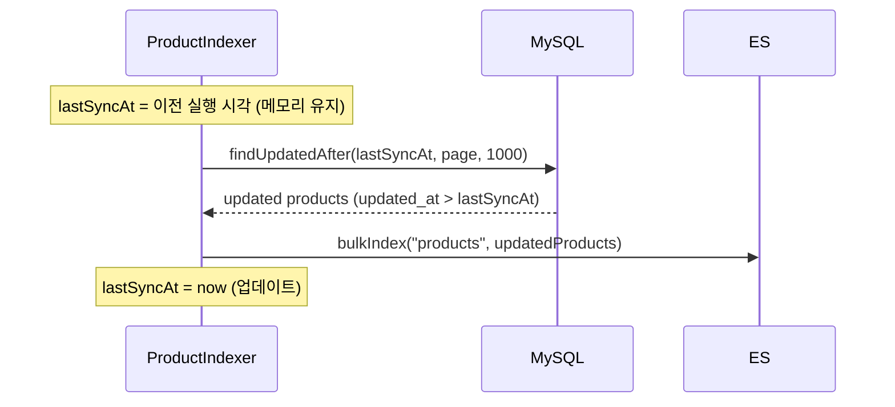

> `lastSyncAt`은 in-memory — 앱 재시작 시 리셋됨 (데모 범위).
> 운영 환경에서는 Debezium(CDC) → Kafka → ES Sink Connector 패턴을 사용한다.

---

## 6. 기능 플로우 — 검색

### 검색 요청 처리

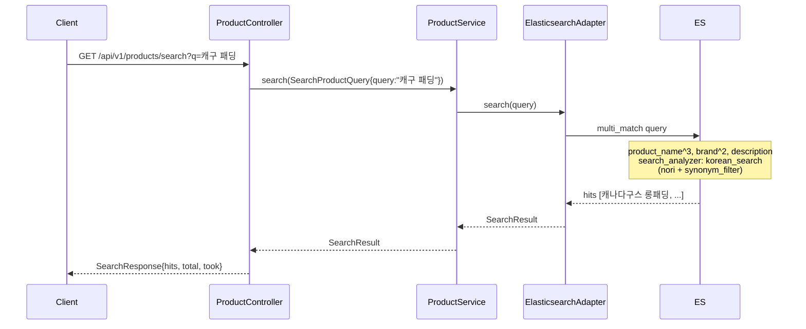

### ES 검색 쿼리 구조

```json
{
  "query": {
    "multi_match": {
      "query": "캐구 패딩",
      "fields": ["product_name^3", "brand^2", "description"],
      "type": "best_fields"
    }
  },
  "highlight": {
    "fields": {
      "product_name": {},
      "description": {}
    }
  }
}
```

`product_name^3`: 상품명 필드에 3배 가중치.
검색 시 `korean_search` 분석기가 적용되어 "캐구"가 동의어 필터를 통해 "캐나다구스"로 확장된다.

---

## 7. 기능 플로우 — 동의어 생성 & 적용

### 7.1 동의어 생성 워크플로우

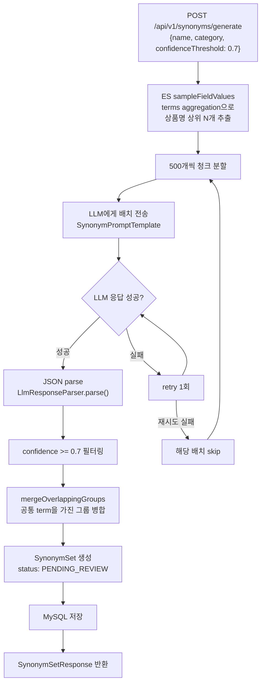

**핵심: 동의어 클러스터 병합 알고리즘**

```kotlin
// LLM이 따로 생성한 그룹들이 공통 term을 공유할 수 있다
// Group A: [캐나다구스, 캐구]
// Group B: [캐구, Canada Goose]
// → 병합: [캐나다구스, 캐구, Canada Goose]

private fun mergeOverlappingGroups(groups: List<SynonymGroup>): List<SynonymGroup> {
    for (i in groups.indices) {
        for (j in (i+1) until groups.size) {
            if (groups[j].terms.any { it in merged.terms }) {
                // 공통 term 발견 → 두 그룹 합치기
                merged = merged.copy(terms = (merged.terms + groups[j].terms).distinct())
            }
        }
    }
}
```

### LLM 프롬프트 설계

```
[System]
당신은 한국 이커머스 검색 엔진의 동의어 사전 전문가입니다.

규칙:
1. 동의어는 "같은 상품/개념을 다르게 표현한 것"만 포함합니다.
2. 상위-하위 개념은 동의어가 아닙니다. (신발 ≠ 운동화)
3. 브랜드명 한글/영문/줄임말은 동의어입니다. (나이키 = Nike = NIKE)
4. 한국 소비자 줄임말을 포함합니다. (캐나다구스 = 캐구)
5. 다의어 주의: 카테고리 컨텍스트에 맞는 의미만 묶습니다.
6. confidence < 0.7 은 제외합니다.

출력: JSON only (마크다운 없이)
{ "synonymGroups": [{ "terms": [...], "type": "EQUIVALENT",
                      "confidence": 0.95, "reasoning": "..." }] }
```

**설계 포인트:**
- `reasoning` 필드 강제 → LLM이 신중하게 판단 (Chain-of-Thought 효과)
- `confidence` threshold → 억지 동의어 차단
- "상위-하위 개념 제외" 명시 → 신발→운동화→나이키 같은 잘못된 그룹 방지
- JSON 파싱 실패 시 `LlmResponseParser`가 markdown 코드블록(```` ```json ````...) 자동 제거 후 재시도

### 7.2 동의어 적용 — 전략 선택

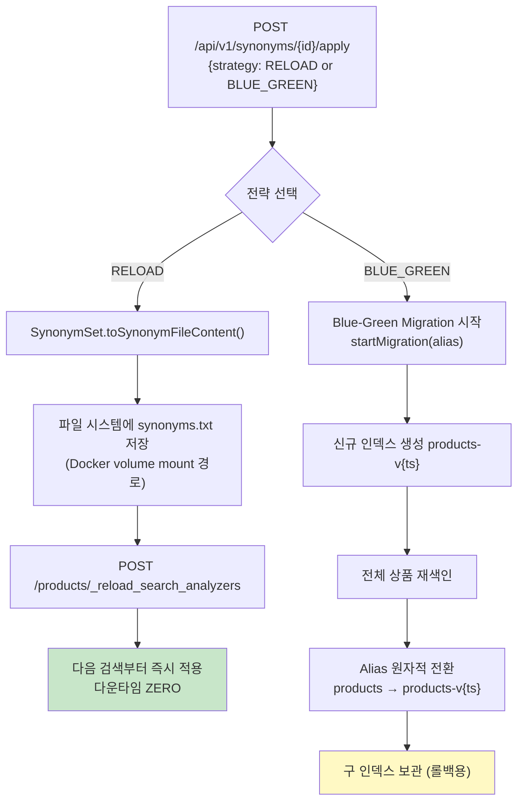

**Reload 전략의 ES 내부 메커니즘:**

```
search_analyzer에만 synonym_filter를 적용하고
updateable: true로 설정해두면, 인덱스를 닫지 않고
_reload_search_analyzers API로 동의어를 즉시 교체할 수 있다.

index_analyzer: nori만 적용 (색인 시점)
search_analyzer: nori + synonym_filter (검색 시점) ← updateable
```

---

## 8. 기능 플로우 — 분석기 추천

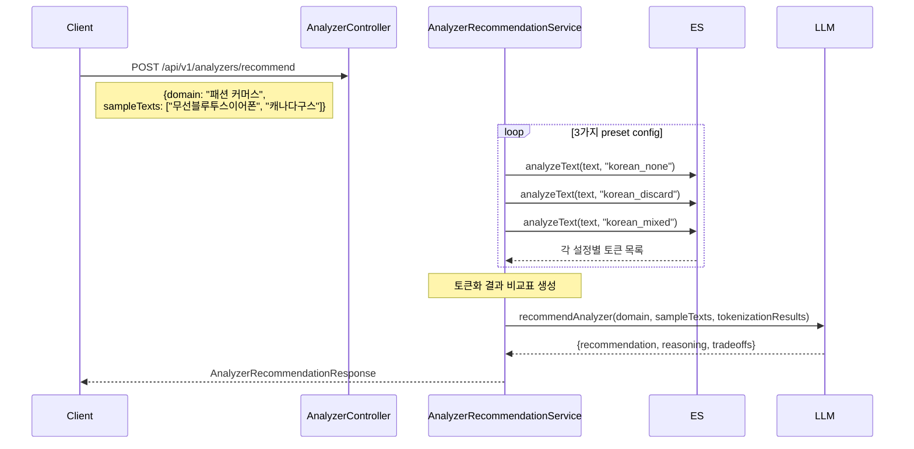

**3가지 Nori Decompound Mode 비교:**

| 모드 | "무선블루투스이어폰" 토큰 | 특징 |
|---|---|---|
| `none` | `무선블루투스이어폰` | 분리 안 함. 복합명사 검색 어려움 |
| `discard` | `무선`, `블루투스`, `이어폰` | 분리 후 원형 제거. 재현율 ↑, 정밀도 ↓ |
| `mixed` | `무선블루투스이어폰`, `무선`, `블루투스`, `이어폰` | 원형 + 분리어 모두 보존. **권장** |

---

## 9. 기능 플로우 — 검색 품질 평가

### 9.1 3-Layer 평가 파이프라인

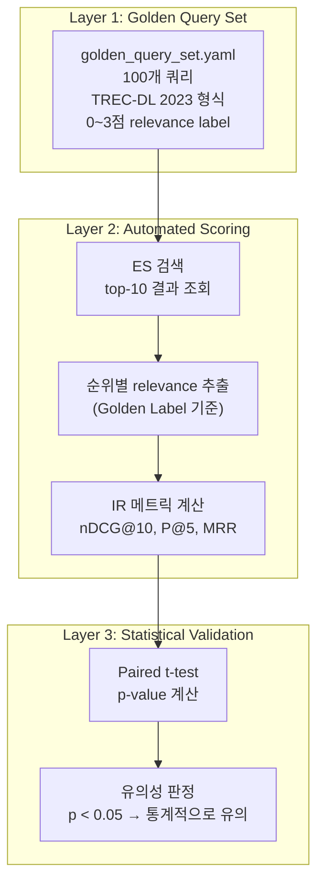

### 9.2 단일 쿼리 채점 플로우

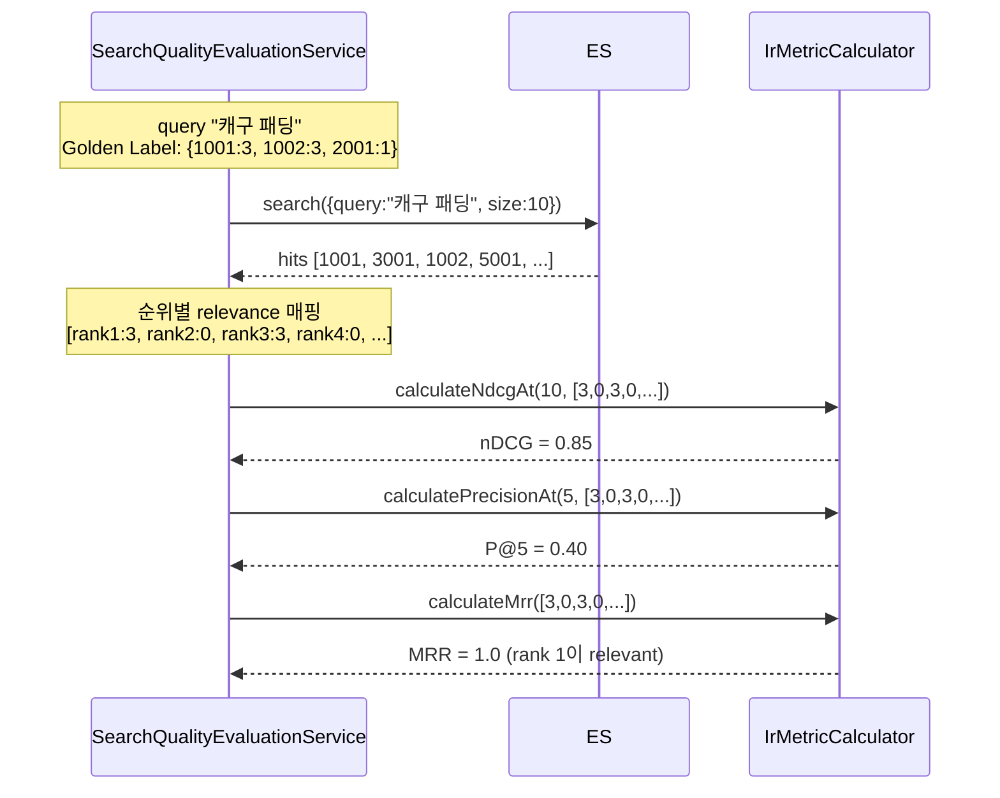

### 9.3 Golden Query Set 구성 (100개)

| 카테고리 | 개수 | 예시 |
|---|---|---|
| 브랜드 동의어 (한글/영문) | 20 | "나이키 운동화", "Nike 런닝화", "캐구 패딩" |
| 줄임말/신조어 | 15 | "에팟 프로", "갓성비 무선청소기", "홈트 기구" |
| 복합명사 (붙여쓰기) | 15 | "무선블루투스이어폰", "남성용겨울장갑" |
| 오타 | 10 | "블루투쓰 이어폰", "나이끼 운동화" |
| 카테고리 모호성 | 10 | "배" (과일 vs 배낭), "크림" (화장품 vs 식품) |
| 일반 키워드 | 30 | "겨울 코트", "요가 매트" |

---

## 10. 기능 플로우 — A/B 비교 & 통계 검증

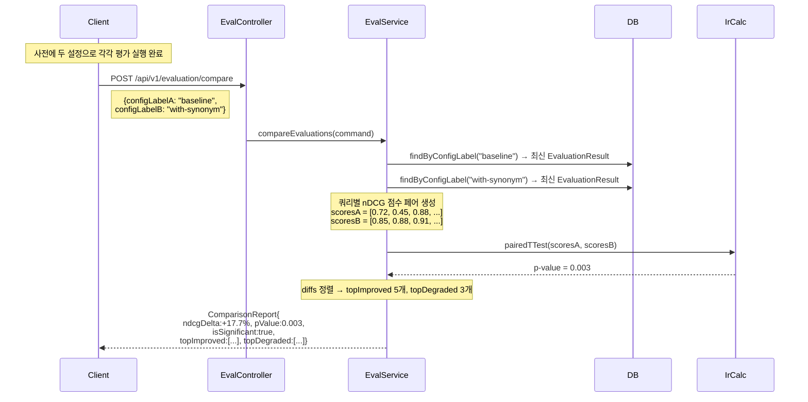

**결과 리포트 형태:**

```
Config A (baseline) vs Config B (with-synonym)

Metric      │ Config A │ Config B │ Δ
────────────┼──────────┼──────────┼────────
nDCG@10     │ 0.7234   │ 0.8512   │ +17.7%
P@5         │ 0.6800   │ 0.8100   │ +19.1%
MRR         │ 0.7456   │ 0.8823   │ +18.3%
p-value     │          │          │ 0.003

→ 통계적으로 유의한 차이 (p < 0.05)

Top 5 개선된 쿼리:
  1. "캐구 패딩"      0.31 → 0.95  (+206%)
  2. "블루투쓰 이어폰" 0.45 → 0.88  (+96%)

Top 3 저하된 쿼리 (주의):
  1. "배 과일"        0.82 → 0.65  (-21%)  ← 다의어 충돌
```

---

## 11. 기능 플로우 — Blue-Green 마이그레이션

분석기 설정이나 매핑 자체를 바꿀 때 사용한다. ES 인덱스를 통째로 교체하면서 알리아스 전환으로 무중단을 보장한다.

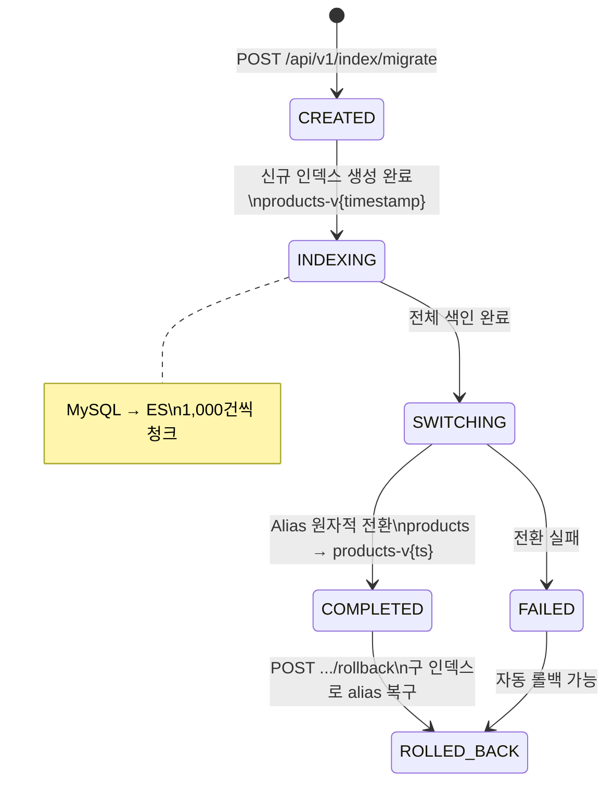

**Alias 전환이 왜 다운타임 제로인가:**

```json
// 이 두 작업이 하나의 원자적 트랜잭션으로 실행됨
POST /_aliases
{
  "actions": [
    { "remove": { "index": "products-v1", "alias": "products" } },
    { "add":    { "index": "products-v2", "alias": "products" } }
  ]
}
// remove와 add 사이에 검색이 끊기는 순간이 없음
```

---

## 12. IR 메트릭 수학적 원리

모든 계산은 `IrMetricCalculator.kt` (외부 의존성 없이 Kotlin만 사용)에 구현되어 있다.

### nDCG@10 (Normalized Discounted Cumulative Gain)

```
DCG@k = Σ(i=1..k) rel_i / log₂(i + 1)

iDCG@k = 이상적인 순위(관련도 내림차순)로 계산한 DCG

nDCG@k = DCG@k / iDCG@k   (0.0 ~ 1.0)
```

**직관:** 순위가 낮을수록(뒤에 있을수록) log₂ 분모가 커져 기여도가 줄어든다.
관련도 3짜리 문서가 1위에 있으면 3/log₂(2)=3.0, 5위에 있으면 3/log₂(6)≈1.16.

```
예시: 쿼리 "캐구 패딩"
  rank 1: rel=3 → 3 / log₂(2) = 3.000
  rank 2: rel=0 → 0
  rank 3: rel=3 → 3 / log₂(4) = 1.500
  rank 4: rel=0 → 0
  DCG = 4.500

  이상적 순위: [3,3,0,0,...] → iDCG = 3/1 + 3/1.585 = 4.893
  nDCG@10 = 4.500 / 4.893 = 0.920
```

### P@5 (Precision at 5)

```
P@5 = (상위 5개 결과 중 관련 있는 결과 수) / 5
```

"관련 있다"는 relevance > 0인 경우(즉, 0점이 아닌 경우).

### MRR (Mean Reciprocal Rank)

```
MRR = 1 / (첫 번째 관련 결과의 순위)
```

관련 결과가 1위면 1.0, 2위면 0.5, 3위면 0.333, 없으면 0.

### Paired t-test (p-value 계산)

외부 라이브러리(Commons Math) 없이 직접 구현했다.

```
H₀: 설정 A와 B의 쿼리별 nDCG 차이 = 0
H₁: 차이 ≠ 0

diffs[i] = nDCG_B[i] - nDCG_A[i]    (각 쿼리에 대해)
mean_diff = Σ diffs / n
t = mean_diff / (std_dev / √n)

p-value: t 분포의 양측 검정
→ p < 0.05: "B가 A보다 통계적으로 유의하게 좋다"
```

t 분포 p-value는 불완전 베타 함수를 연분수 전개(Lentz 알고리즘)로 계산하고,
log-Gamma는 Lanczos 근사(g=7, n=9 계수)를 사용한다.

---

## 13. Elasticsearch 인덱스 설계

### 분석기 체인

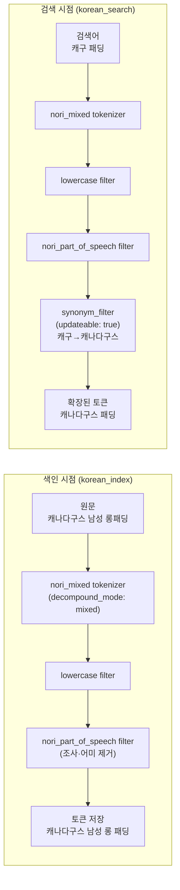

**핵심:** `synonym_filter`는 **search_analyzer에만** 적용된다.
index_analyzer에 적용하면 동의어 변경 시 전체 재색인이 필요하지만,
search_analyzer에만 적용하면 `_reload_search_analyzers` API만으로 즉시 반영된다.

### 매핑 구조

```json
{
  "product_name": {
    "type": "text",
    "analyzer": "korean_index",
    "search_analyzer": "korean_search",
    "fields": {
      "keyword": { "type": "keyword" }
    }
  },
  "brand": {
    "type": "text",
    "analyzer": "korean_index",
    "search_analyzer": "korean_search"
  },
  "category": { "type": "keyword" },
  "price": { "type": "scaled_float", "scaling_factor": 100 }
}
```

`product_name.keyword` — terms aggregation으로 동의어 생성 시 상품명 샘플링에 사용.

### 동의어 파일 포맷 (product_synonyms.txt)

```
# EQUIVALENT: 모든 term이 동등하게 매칭
나이키, Nike, NIKE, 나이크
캐나다구스, 캐구, Canada Goose

# ONEWAY: term1 검색 시 term2도 매칭 (반대는 아님)
에팟 => 에어팟
블루투쓰 => 블루투스
```

---

## 14. 전체 API 목록

### Products

| Method | Path | 설명 |
|---|---|---|
| `GET` | `/api/v1/products` | 상품 목록 (페이지네이션) |
| `GET` | `/api/v1/products/{id}` | 상품 단건 조회 |
| `POST` | `/api/v1/products` | 상품 생성 |
| `GET` | `/api/v1/products/search?q={query}` | ES 검색 (GET) |
| `POST` | `/api/v1/products/search` | ES 검색 (explain/highlight 옵션 포함) |
| `POST` | `/api/v1/products/search/analyze` | 텍스트 분석기 토큰화 테스트 |

### Index

| Method | Path | 설명 |
|---|---|---|
| `POST` | `/api/v1/index/full` | 전체 색인 시작 (비동기) |
| `POST` | `/api/v1/index/sync` | 증분 색인 시작 (비동기) |
| `GET` | `/api/v1/index/jobs/{jobId}` | 색인 Job 상태 조회 |
| `POST` | `/api/v1/index/migrate` | Blue-Green 마이그레이션 시작 |
| `GET` | `/api/v1/index/migrate/{migrationId}` | 마이그레이션 상태 조회 |
| `POST` | `/api/v1/index/migrate/{migrationId}/rollback` | 마이그레이션 롤백 |

### Synonyms

| Method | Path | 설명 |
|---|---|---|
| `POST` | `/api/v1/synonyms/generate` | LLM으로 동의어 생성 |
| `GET` | `/api/v1/synonyms` | 동의어 세트 목록 |
| `GET` | `/api/v1/synonyms/{id}` | 동의어 세트 단건 조회 |
| `GET` | `/api/v1/synonyms/{id}/download` | `.txt` 파일로 다운로드 |
| `POST` | `/api/v1/synonyms/{id}/apply` | ES에 적용 (RELOAD or BLUE_GREEN) |
| `PATCH` | `/api/v1/synonyms/{id}/groups/{groupId}` | 동의어 그룹 수정 |

### Analyzers

| Method | Path | 설명 |
|---|---|---|
| `POST` | `/api/v1/analyzers/recommend` | LLM 분석기 추천 |
| `POST` | `/api/v1/analyzers/compare` | 분석기 설정 비교 |

### Evaluation

| Method | Path | 설명 |
|---|---|---|
| `POST` | `/api/v1/evaluation/run` | 품질 평가 실행 (nDCG@10, P@5, MRR) |
| `POST` | `/api/v1/evaluation/compare` | A/B 비교 + paired t-test |
| `GET` | `/api/v1/evaluation/{id}/report` | 평가 결과 조회 |
| `GET` | `/api/v1/evaluation/query-sets` | 쿼리 세트 목록 |
| `POST` | `/api/v1/evaluation/query-sets` | 커스텀 쿼리 세트 등록 |

---

## 15. 인프라 & 실행 방법

### Docker Compose 구성

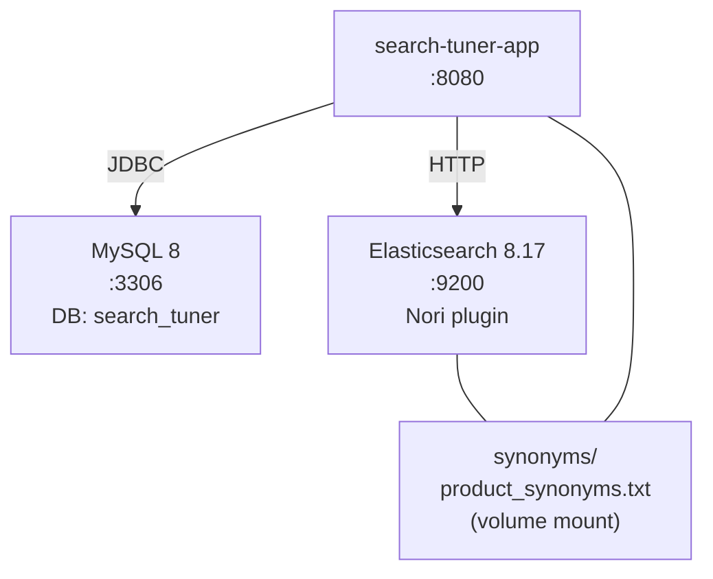

```bash
# 인프라만 먼저 기동 (앱 제외)
docker compose up mysql elasticsearch

# 앱 포함 전체 기동
docker compose --profile full up
```

### 시작 시 자동 실행 순서

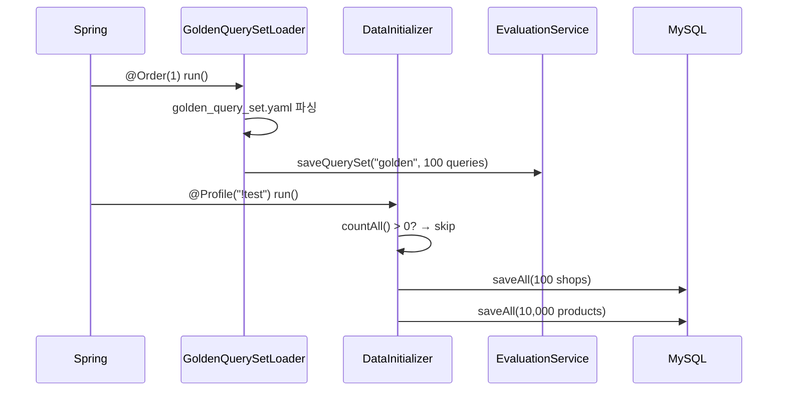

### 검증 시나리오

```bash
# 1. 전체 색인
curl -X POST http://localhost:8080/api/v1/index/full
# → {"jobId":"xxx", "status":"PENDING"}

# 2. Job 상태 확인
curl http://localhost:8080/api/v1/index/jobs/xxx
# → {"status":"COMPLETED", "indexed":10000, "progressPercent":100}

# 3. 기본 검색
curl "http://localhost:8080/api/v1/products/search?q=패딩"

# 4. 동의어 생성 (LLM API 키 필요)
curl -X POST http://localhost:8080/api/v1/synonyms/generate \
  -H "Content-Type: application/json" \
  -d '{"name":"fashion-synonyms","category":"패션/의류","confidenceThreshold":0.7}'

# 5. 동의어 적용 (다운타임 없이)
curl -X POST http://localhost:8080/api/v1/synonyms/1/apply \
  -d '{"strategy":"RELOAD","indexName":"products"}'

# 6. 품질 평가
curl -X POST http://localhost:8080/api/v1/evaluation/run \
  -d '{"configLabel":"baseline","indexName":"products","querySetId":"golden"}'

# 7. Swagger UI
open http://localhost:8080/swagger-ui.html
```

### 환경변수

```yaml
SPRING_DATASOURCE_URL: jdbc:mysql://localhost:3306/search_tuner
SPRING_DATASOURCE_USERNAME: tuner
SPRING_DATASOURCE_PASSWORD: tuner123
ES_HOST: localhost
ES_PORT: 9200
# LLM 제공자 중 하나 설정 (Claude > Gemini > OpenAI 우선순위)
GEMINI_API_KEY: ...             # Google Gemini
GEMINI_MODEL: gemini-2.5-flash-lite
# OPENAI_API_KEY: sk-...        # OpenAI
# OPENAI_MODEL: gpt-4o-mini
# ANTHROPIC_API_KEY: sk-ant-... # Anthropic Claude
# ANTHROPIC_MODEL: claude-3-5-haiku-20241022
ES_SYNONYMS_PATH: ./docker/elasticsearch/config/synonyms/product_synonyms.txt
```

---

## 16. 기술 결정 이유 (ADR 요약)

### Spring Boot 3.4.3 (4.0.3 → 다운그레이드)

Spring Boot 4.0.3은 Spring AI 및 ES Java Client 8.x와 의존성 충돌이 있다.
Spring AI 1.0.0 GA는 Spring Boot 3.4.x BOM 기준으로 동작한다.

### Spring AI Starter 아티팩트명 변경

Spring AI 1.0.0 GA에서 스타터 아티팩트명이 변경됐다.

```
이전 (M6 이하): spring-ai-openai-spring-boot-starter
이후 (1.0.0 GA): spring-ai-starter-model-openai
```

### Thread 대신 @Async 미사용

Spring의 `@Async`는 AOP 프록시를 통해 동작한다.
같은 클래스 내에서 메서드를 호출하면 프록시를 거치지 않아 `@Async`가 무효화된다.
`ProductIndexer.startFullIndex()` → `runFullIndex()` 호출이 이 패턴이므로
`Thread { runFullIndex(...) }.start()` 방식으로 직접 실행했다.

### search-time synonym vs index-time synonym

| | index-time | search-time (채택) |
|---|---|---|
| 동의어 변경 시 | 전체 재색인 필요 | reload API 호출만으로 즉시 반영 |
| 성능 | 색인 부하 분산 | 검색 시 약간의 추가 연산 |
| 관리 용이성 | 어려움 | 쉬움 |

### 인메모리 QuerySet 저장

`SearchQualityEvaluationService.querySets`는 `MutableMap`으로 메모리에 보관된다.
Golden Query Set은 앱 시작 시 YAML에서 로드되고, 커스텀 쿼리는 API로 추가할 수 있다.
재시작 시 YAML 쿼리는 자동 복원되므로 DB 저장 없이 충분하다 (데모 범위).

### LLM 응답 파싱 전략

LLM은 종종 JSON을 마크다운 코드블록으로 감싸서 응답한다.
`LlmResponseParser`가 ` ``` `json ... ` ``` ` 패턴을 자동으로 제거한 뒤 파싱한다.
파싱 실패 시 retry 1회, 그래도 실패하면 해당 배치를 skip하고 계속 진행한다.

### Paired t-test 직접 구현

외부 라이브러리(Apache Commons Math) 의존 없이
Lanczos log-gamma 근사 + 불완전 베타 함수 연분수 전개로 p-value를 계산했다.
`search-tuner-core`를 순수 Kotlin으로 유지하기 위한 결정이다 (Spring, DB 무의존 원칙).
